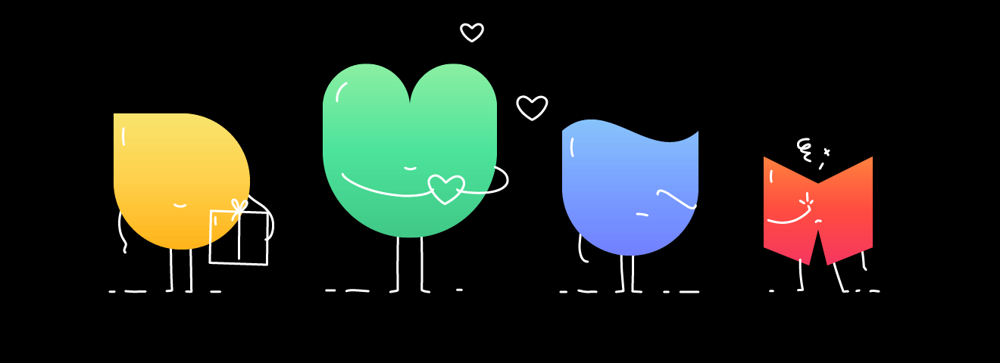

# Aidify 🤝

Aidify is a full-stack web platform built to connect communities, facilitating aid and support where it's needed most. Whether providing resources or seeking assistance, Aidify bridges the gap.

**[🌐 Live Demo]((#))** <!-- Add your deployment link here (e.g., Vercel, Render) -->

<div align="center">
  
</div>

## ✨ Features

- **Request Creation**: Users can easily post for help or offer resources in their community.
- **Resource Matching**: View, filter, and respond to ongoing community needs.
- **Responsive Design**: Built with a mobile-first approach, ensuring seamless access across all devices.
- **REST API**: A robust, decoupled Express API handling data interactions smoothly.

## 🚀 Tech Stack

### Frontend
- **React 19** with **Vite**
- **TypeScript** for robust typing
- **React Router** for seamless navigation
- **ESLint & Globals** for code quality

### Backend
- **Node.js** & **Express** for a fast, unopinionated web server
- **MongoDB** & **Mongoose** for flexible NoSQL database interactions
- **CORS** middleware enabled for seamless frontend-backend communication

## 📂 Project Structure

```text
aidify/
├── backend/          # Node.js/Express server API
│   ├── models/       # Mongoose database schemas
│   ├── routes/       # API endpoints (e.g., /api/requests)
│   ├── index.js      # Main server entry point
│   └── .env          # Environment variables (MongoDB URI, Port)
└── frontend/         # React/Vite frontend application
    ├── public/       # Static assets
    ├── src/          # React components, pages, and styles
    └── vite.config.ts # Vite configuration
```

## 🛠️ Setup & Installation

Follow these steps to get a local copy up and running.

### Prerequisites

- [Node.js](https://nodejs.org/) installed
- [MongoDB](https://www.mongodb.com/) running locally or a MongoDB Atlas URI

### 1. Clone the repository

```bash
git clone https://github.com/kmanu28/aidify.git
cd aidify
```

### 2. Setup the Backend

```bash
cd backend
npm install
```

Create a `.env` file in the `backend` directory and add your MongoDB connection string and port:

```env
MONGO_URI="mongodb://localhost:27017/aidify" # Example URI
PORT=3000
```

Start the backend server:

```bash
# Using nodemon for development (if installed globally)
nodemon index.js
# Or standard start
node index.js
```

### 3. Setup the Frontend

Open a new terminal window/tab:

```bash
cd frontend
npm install
```

Start the Vite development server:

```bash
npm run dev
```

## 🌐 Running the Application

Once both servers are running:
- **Frontend** will typically be available at `http://localhost:5173` (check the terminal output from Vite).
- **Backend API** will be running at `http://localhost:3000`.

## 🔮 Future Enhancements

- [ ] **Full-stack TypeScript**: Migrate the Node.js backend from `.js` to `.ts` for complete end-to-end type safety.
- [ ] **User Authentication**: Implement JWT or Firebase Auth for secure user accounts.
- [ ] **Real-time Updates**: Integrate Socket.io for live notifications on new community requests.
- [ ] **Geospatial Queries**: Use MongoDB GeoJSON to show requests closest to a user's location.

## 🤝 Contributing

Contributions are what make the open source community such an amazing place to learn, inspire, and create. Any contributions you make are **greatly appreciated**.

1. Fork the Project
2. Create your Feature Branch (`git checkout -b feature/AmazingFeature`)
3. Commit your Changes (`git commit -m 'Add some AmazingFeature'`)
4. Push to the Branch (`git push origin feature/AmazingFeature`)
5. Open a Pull Request

## 📄 License

Distributed under the MIT License. See `LICENSE` for more information.
